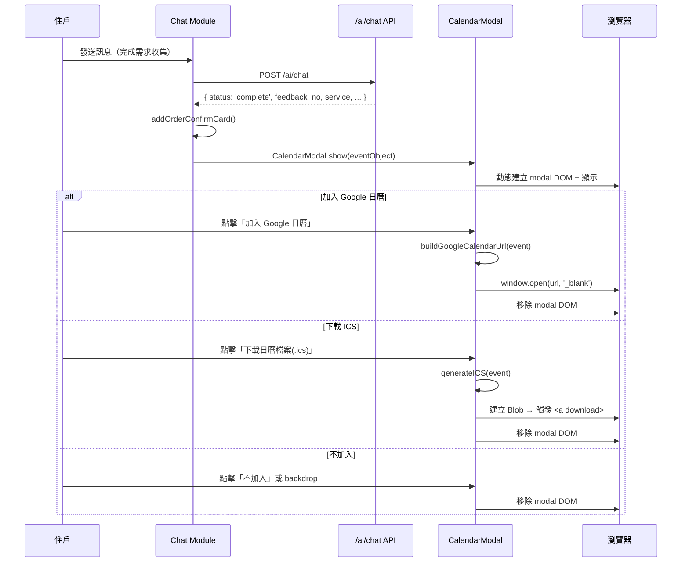

# Design Document — Order Calendar Modal

## Overview

本功能為純前端行事曆提醒模組，在 AI 聊天建單成功後自動彈出自訂 Modal，讓住戶選擇將服務預約加入 Google 日曆（開新分頁）或下載 .ics 日曆檔案，也可選擇不加入直接關閉。

模組設計為獨立可重用元件 `CalendarModal`，不依賴 Chat 模組內部狀態，僅接收 `Event_Object` 作為輸入。整體不涉及後端修改。

---

## Architecture

### 架構決策

| 決策 | 選擇 | 理由 |
|------|------|------|
| Modal 實作方式 | 動態 DOM 建立（JS 內產生 HTML） | 避免在 index.html 預置隱藏元素，元件自包含、好移植 |
| CSS 載入 | 獨立 `css/calendar-modal.css` | 與既有 CSS 模組化一致（chat.css、services.css 等） |
| 時間計算 | 純前端 `new Date()` + 固定偏移 | API 不回傳 order_time，統一使用瀏覽器當下時間 |
| ICS 產生 | 前端字串組裝 + Blob download | 不需額外 library，RFC 5545 VEVENT 結構簡單 |
| 模組掛載 | 全域 `CalendarModal` 物件 | 與專案既有模式一致（`Chat`、`Utils` 等皆為全域物件） |

### 檔案結構

```
ai-community-web/
├── css/calendar-modal.css   ← 新增：Modal 樣式
├── js/calendar-modal.js     ← 新增：CalendarModal 模組
├── js/chat.js               ← 修改：觸發 CalendarModal.show()
└── index.html               ← 修改：加入 script 標籤
```

### 流程序列圖



---

## Components and Interfaces

### CalendarModal（`js/calendar-modal.js`）

```javascript
const CalendarModal = {
  /**
   * 顯示行事曆提醒 Modal
   * @param {EventObject} event - 事件資料物件
   */
  show(event) {},

  /**
   * 建立 Event_Object（供外部呼叫端使用的輔助方法）
   * @param {string} service - 服務名稱
   * @param {string} feedbackNo - 諮詢單號
   * @param {Date} baseDate - 基準日期（預設 new Date()）
   * @returns {EventObject}
   */
  createEvent(service, feedbackNo, baseDate) {},

  /**
   * 計算事件時間（baseDate + 1 天，14:00~15:00 UTC+8）
   * @param {Date} baseDate
   * @returns {{ startTime: Date, endTime: Date }}
   */
  calcEventTime(baseDate) {},

  /**
   * 格式化日期為 YYYYMMDDTHHmmssZ
   * @param {Date} date
   * @returns {string}
   */
  formatDateUTC(date) {},

  /**
   * 組合 Google Calendar URL
   * @param {EventObject} event
   * @returns {string}
   */
  buildGoogleCalendarUrl(event) {},

  /**
   * 產生 ICS 檔案內容字串
   * @param {EventObject} event
   * @returns {string}
   */
  generateICS(event) {},

  /**
   * 觸發瀏覽器下載 ICS 檔案
   * @param {string} icsContent
   * @param {string} filename
   */
  downloadFile(icsContent, filename) {},

  /**
   * 關閉並移除 modal DOM
   */
  close() {},
};
```

### Event_Object 介面

```javascript
/**
 * @typedef {Object} EventObject
 * @property {string} title       - 服務名稱（e.g. "清潔"）
 * @property {string} description - 事件描述（含諮詢單號）
 * @property {string} location    - 地點（固定空字串）
 * @property {Date}   startTime   - 開始時間（baseDate+1 天 14:00 UTC+8）
 * @property {Date}   endTime     - 結束時間（baseDate+1 天 15:00 UTC+8）
 */
```

### Chat Module 修改點

在 `chat.js` 的 `handleSend()` 中，`addOrderConfirmCard()` 之後新增：

```javascript
if (data.status === 'complete' && data.feedback_no) {
  this.addOrderConfirmCard(data.feedback_no, data.intent, data.collected);
  // 觸發行事曆提醒 Modal
  const calEvent = CalendarModal.createEvent(
    data.service,
    data.feedback_no,
    new Date()
  );
  CalendarModal.show(calEvent);
}
```

---

## Data Models

### Event_Object 結構

| 欄位 | 型別 | 來源 | 範例 |
|------|------|------|------|
| `title` | string | `data.service` | `"清潔"` |
| `description` | string | 模板字串 + `data.feedback_no` | `"服務已成立，諮詢單號 FB20250202001，廠商將盡快與您聯繫確認詳細時段"` |
| `location` | string | 固定空字串 | `""` |
| `startTime` | Date | `baseDate` + 1 天, 14:00 UTC+8 | `2025-02-03T06:00:00Z` |
| `endTime` | Date | `baseDate` + 1 天, 15:00 UTC+8 | `2025-02-03T07:00:00Z` |

### 時間計算邏輯

```
輸入: baseDate = new Date()  // 觸發當下瀏覽器時間

步驟:
1. nextDay = new Date(baseDate)
2. nextDay.setDate(nextDay.getDate() + 1)
3. startTime = new Date(Date.UTC(
     nextDay.getFullYear(),
     nextDay.getMonth(),
     nextDay.getDate(),
     6, 0, 0  // 14:00 UTC+8 = 06:00 UTC
   ))
4. endTime = new Date(Date.UTC(
     nextDay.getFullYear(),
     nextDay.getMonth(),
     nextDay.getDate(),
     7, 0, 0  // 15:00 UTC+8 = 07:00 UTC
   ))
```

> **注意**：`nextDay.getFullYear()` / `getMonth()` / `getDate()` 使用 local time 取得日期部分（因為「隔天」是以使用者所在時區計算），但最終以 UTC 絕對時間輸出。台灣使用者的瀏覽器時區固定為 UTC+8，無 DST 問題。

### Google Calendar URL 格式

```
https://www.google.com/calendar/render?action=TEMPLATE
  &text={encodeURIComponent(title)}
  &dates={YYYYMMDDTHHmmssZ}/{YYYYMMDDTHHmmssZ}
  &details={encodeURIComponent(description)}
  &location={encodeURIComponent(location)}
```

### ICS 檔案格式

```
BEGIN:VCALENDAR
VERSION:2.0
PRODID:-//Ai Community//Calendar//TW
BEGIN:VEVENT
UID:{timestamp}-{random}@ai-community
DTSTART:{YYYYMMDDTHHmmssZ}
DTEND:{YYYYMMDDTHHmmssZ}
SUMMARY:{title}
DESCRIPTION:{description}
LOCATION:{location}
END:VEVENT
END:VCALENDAR
```

UID 生成規則：`Date.now() + '-' + Math.random().toString(36).substr(2, 9) + '@ai-community'`

---

## Correctness Properties

*A property is a characteristic or behavior that should hold true across all valid executions of a system—essentially, a formal statement about what the system should do. Properties serve as the bridge between human-readable specifications and machine-verifiable correctness guarantees.*

### Property 1: 事件時間計算正確性

*For any* valid base date, the calculated start time SHALL equal the base date + 1 calendar day at 06:00 UTC (14:00 UTC+8), and the calculated end time SHALL equal the base date + 1 calendar day at 07:00 UTC (15:00 UTC+8). Additionally, end time SHALL always be exactly 1 hour after start time.

**Validates: Requirements 3.1, 3.2, 3.3**

### Property 2: UTC 日期格式化正確性

*For any* valid Date object, `formatDateUTC(date)` SHALL produce a string matching the pattern `/^\d{8}T\d{6}Z$/` (YYYYMMDDTHHmmssZ), and the formatted string SHALL be reversible back to the same UTC timestamp.

**Validates: Requirements 3.4**

### Property 3: Event_Object 組裝完整性

*For any* non-empty service name string and non-empty feedback_no string, `createEvent(service, feedbackNo, baseDate)` SHALL produce an Event_Object where: title equals service, description contains feedback_no, location equals empty string, and startTime/endTime are valid Dates.

**Validates: Requirements 4.1, 4.2, 4.3, 1.2**

### Property 4: Google Calendar URL 結構正確性

*For any* valid Event_Object (including titles and descriptions with unicode characters, spaces, and special characters), `buildGoogleCalendarUrl(event)` SHALL produce a URL that: starts with `https://www.google.com/calendar/render?action=TEMPLATE`, contains properly URI-encoded text/details/location parameters, and contains dates in YYYYMMDDTHHmmssZ/YYYYMMDDTHHmmssZ format.

**Validates: Requirements 5.1, 5.2**

### Property 5: ICS 內容 round-trip

*For any* valid Event_Object, generating ICS content then parsing it back to extract DTSTART, DTEND, SUMMARY, DESCRIPTION, and LOCATION SHALL produce values equivalent to the original Event_Object fields.

**Validates: Requirements 6.1, 6.2, 6.3, 6.6**

### Property 6: Modal DOM cleanup

*For any* sequence of `CalendarModal.show()` followed by `CalendarModal.close()`, the document SHALL contain zero elements with class `calendar-modal-overlay` after close completes.

**Validates: Requirements 8.4, 7.2**

---

## Error Handling

| 情境 | 處理方式 |
|------|---------|
| `data.service` 為 undefined/null | `createEvent` 預設 title 為 `"服務提醒"` |
| `data.feedback_no` 為 undefined/null | description 中以空字串替代，不阻擋 modal 顯示 |
| `window.open` 被 popup blocker 攔截 | 捕捉回傳 null，改用 `location.href` 導向（降級處理） |
| Blob/download 不支援（極舊瀏覽器） | 開啟 data URI 於新視窗做 fallback |
| Modal 已存在時重複呼叫 `show()` | 先移除既有 modal 再建立新的，避免重疊 |
| 使用者在 modal 顯示期間切換頁面 | 無需特殊處理，DOM 隨頁面銷毀 |

---

## Testing Strategy

### 單元測試（Example-based）

| 測試項目 | 驗證內容 |
|---------|---------|
| 觸發整合 | mock Chat.handleSend 回應，驗證 CalendarModal.show 被呼叫 |
| Modal DOM 結構 | show() 後驗證 title、三個按鈕存在 |
| 按鈕文字 | 驗證「加入 Google 日曆」「下載日曆檔案(.ics)」「不加入」|
| Backdrop 關閉 | 模擬 click overlay，驗證 modal 消失 |
| Google 日曆開新分頁 | mock window.open，驗證被呼叫且參數正確 |
| ICS 下載觸發 | mock URL.createObjectURL，驗證 download 被觸發 |

### Property-Based Testing

使用 **fast-check** 作為 property-based testing 框架。

每個 property test 須執行至少 **100 iterations**。

每個 test 須以註解標記對應的 design property：

```javascript
// Feature: order-calendar, Property 1: 事件時間計算正確性
fc.assert(fc.property(
  fc.date({ min: new Date('2020-01-01'), max: new Date('2030-12-31') }),
  (baseDate) => {
    const { startTime, endTime } = CalendarModal.calcEventTime(baseDate);
    const nextDay = new Date(baseDate);
    nextDay.setDate(nextDay.getDate() + 1);
    const expectedStart = new Date(Date.UTC(
      nextDay.getFullYear(), nextDay.getMonth(), nextDay.getDate(), 6, 0, 0
    ));
    const expectedEnd = new Date(Date.UTC(
      nextDay.getFullYear(), nextDay.getMonth(), nextDay.getDate(), 7, 0, 0
    ));
    return startTime.getTime() === expectedStart.getTime()
      && endTime.getTime() === expectedEnd.getTime()
      && (endTime - startTime) === 3600000;
  }
), { numRuns: 100 });
```

```javascript
// Feature: order-calendar, Property 2: UTC 日期格式化正確性
fc.assert(fc.property(
  fc.date(),
  (date) => {
    const formatted = CalendarModal.formatDateUTC(date);
    return /^\d{8}T\d{6}Z$/.test(formatted);
  }
), { numRuns: 100 });
```

```javascript
// Feature: order-calendar, Property 3: Event_Object 組裝完整性
fc.assert(fc.property(
  fc.string({ minLength: 1 }),
  fc.string({ minLength: 1 }),
  fc.date(),
  (service, feedbackNo, baseDate) => {
    const event = CalendarModal.createEvent(service, feedbackNo, baseDate);
    return event.title === service
      && event.description.includes(feedbackNo)
      && event.location === ''
      && event.startTime instanceof Date
      && event.endTime instanceof Date;
  }
), { numRuns: 100 });
```

```javascript
// Feature: order-calendar, Property 4: Google Calendar URL 結構正確性
fc.assert(fc.property(
  fc.string({ minLength: 1 }),
  fc.string({ minLength: 1 }),
  fc.date(),
  (service, feedbackNo, baseDate) => {
    const event = CalendarModal.createEvent(service, feedbackNo, baseDate);
    const url = CalendarModal.buildGoogleCalendarUrl(event);
    return url.startsWith('https://www.google.com/calendar/render?action=TEMPLATE')
      && url.includes('text=')
      && url.includes('dates=')
      && url.includes('details=');
  }
), { numRuns: 100 });
```

```javascript
// Feature: order-calendar, Property 5: ICS 內容 round-trip
fc.assert(fc.property(
  fc.string({ minLength: 1 }),
  fc.string({ minLength: 1 }),
  fc.date({ min: new Date('2020-01-01'), max: new Date('2030-12-31') }),
  (service, feedbackNo, baseDate) => {
    const event = CalendarModal.createEvent(service, feedbackNo, baseDate);
    const ics = CalendarModal.generateICS(event);
    const summary = ics.match(/SUMMARY:(.*)/)[1];
    const desc = ics.match(/DESCRIPTION:(.*)/)[1];
    const loc = ics.match(/LOCATION:(.*)/)[1];
    const dtstart = ics.match(/DTSTART:(.*)/)[1];
    const dtend = ics.match(/DTEND:(.*)/)[1];
    return summary === event.title
      && desc === event.description
      && loc === event.location
      && dtstart === CalendarModal.formatDateUTC(event.startTime)
      && dtend === CalendarModal.formatDateUTC(event.endTime);
  }
), { numRuns: 100 });
```

```javascript
// Feature: order-calendar, Property 6: Modal DOM cleanup
fc.assert(fc.property(
  fc.string({ minLength: 1 }),
  fc.string({ minLength: 1 }),
  fc.date(),
  (service, feedbackNo, baseDate) => {
    const event = CalendarModal.createEvent(service, feedbackNo, baseDate);
    CalendarModal.show(event);
    CalendarModal.close();
    return document.querySelectorAll('.calendar-modal-overlay').length === 0;
  }
), { numRuns: 100 });
```

### CSS 樣式整合

Modal CSS 須使用專案既有 CSS 變數，確保視覺一致：

| 用途 | 變數 |
|------|------|
| 按鈕主色 | `var(--primary)` |
| 卡片背景 | `var(--bg-card)` |
| 圓角 | `var(--radius)` / `var(--radius-sm)` |
| 文字色 | `var(--text-primary)` / `var(--text-secondary)` |
| 邊框 | `var(--border)` |
| 陰影 | `var(--shadow)` |
| 最大寬度 | `var(--max-width)` |
