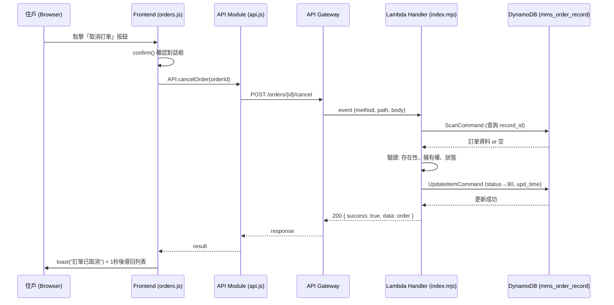

# Design Document: Order Cancel

## Overview

本設計實現訂單取消功能，讓住戶可以在訂單尚未完成/已取消/已退款的狀態下取消訂單。後端 Lambda 新增 `POST /orders/:id/cancel` 路由，使用 `UpdateItemCommand` 更新 DynamoDB 中的訂單狀態；前端新增 API 方法並將目前的模擬行為替換為真實 API 呼叫。

**設計決策：**
- 使用 `UpdateItemCommand` 而非 `PutItemCommand`，避免覆寫整筆訂單資料，僅更新 `order_status` 與 `upd_time` 欄位
- 取消前先以 `dbScan` 查詢訂單是否存在（沿用既有 `handleOrderDetail` 的查詢模式，因 `record_id` 為 Number 型別需轉型）
- 前端防止重複提交使用簡單的 flag 變數，避免引入額外的 debounce 依賴

## Architecture



## Components and Interfaces

### 1. Lambda Handler — Cancel Route (index.mjs)

**新增 import：**
```javascript
import {
  DynamoDBClient,
  GetItemCommand,
  PutItemCommand,
  QueryCommand,
  ScanCommand,
  UpdateItemCommand,  // 新增
} from '@aws-sdk/client-dynamodb';
```

**新增路由匹配（必須放在既有 `GET /orders/:id` 路由之前）：**
```javascript
// Cancel Order — 必須在 GET /orders/:id 之前匹配
if (/^\/orders\/(.+)\/cancel$/.test(path) && method === 'POST') {
  return handleCancelOrder(path.match(/^\/orders\/(.+)\/cancel$/)[1], body);
}
```

**新增 handler function：**
```javascript
const NON_CANCELLABLE_STATUS = ['80', '90', '99'];

async function handleCancelOrder(orderId, body) {
  const accountId = (body.inbr_account_id || '').trim();
  if (!accountId) return fail('缺少 account_id', 400);

  // 查詢訂單（record_id 為 N 型別，需轉 Number）
  const items = await dbScan('mms_order_record',
    'record_id = :rid',
    { ':rid': Number(orderId) }
  );

  if (!items.length) return fail('訂單不存在', 404);
  const order = items[0];

  // 驗證擁有權
  if (order.inbr_account_id !== accountId) {
    return fail('無權操作此訂單', 403);
  }

  // 驗證狀態
  if (NON_CANCELLABLE_STATUS.includes(order.order_status)) {
    return fail('此訂單狀態無法取消', 400);
  }

  // 執行更新
  const now = new Date().toISOString();
  const result = await ddb.send(new UpdateItemCommand({
    TableName: 'mms_order_record',
    Key: marshall({ record_id: Number(orderId) }),
    UpdateExpression: 'SET order_status = :s, upd_time = :t',
    ExpressionAttributeValues: marshall({ ':s': '90', ':t': now }),
    ReturnValues: 'ALL_NEW',
  }));

  const updated = unmarshall(result.Attributes);
  return ok(formatOrder(updated), '訂單已取消');
}
```

**介面：**
- Input: `orderId` (string from URL path), `body` ({ inbr_account_id: string })
- Output: `{ success: true, data: formattedOrder, message: '訂單已取消' }` 或 error response

### 2. Frontend API Module (api.js)

**新增方法：**
```javascript
cancelOrder(orderId) {
  const user = JSON.parse(localStorage.getItem('ai_user') || '{}');
  const accountId = user.inbr_account_id || 'MBR001';
  return this.post(`/orders/${orderId}/cancel`, { inbr_account_id: accountId });
},
```

位置：放在 `createOrder` 方法之後、`getCounties` 方法之前。

### 3. Frontend Orders Module (orders.js)

**修改 `cancelOrder` 方法：**
```javascript
_cancelInProgress: false,

async cancelOrder(orderId) {
  if (!Utils.confirm('確定要取消此訂單嗎？')) return;
  if (this._cancelInProgress) return;

  this._cancelInProgress = true;
  const result = await API.cancelOrder(orderId);
  this._cancelInProgress = false;

  if (result && result.success) {
    Utils.toast('訂單已取消');
    setTimeout(() => Utils.navigate('orders.html'), 1000);
  } else {
    Utils.toast(result?.message || '取消失敗，請稍後再試');
  }
},
```

**取消按鈕顯示條件（維持現有邏輯，更新狀態集合）：**

目前 orders.js 中按鈕顯示條件為 `['01', '02', '03', '11', '12', '13']`，根據需求應改為 `['01', '02', '03', '04']`（Cancellable_Status）。

```javascript
if (['01', '02', '03', '04'].includes(order.order_status)) {
  actionsHtml += `<button class="btn btn-outline btn-block" onclick="Orders.cancelOrder('${order.record_id}')">取消訂單</button>`;
}
```

## Data Models

無新增資料表。使用既有的 `mms_order_record` 表：

| 欄位 | 型別 | 說明 |
|------|------|------|
| record_id | Number (PK) | 訂單主鍵 |
| inbr_account_id | String (GSI PK) | 住戶帳號 |
| order_status | String | 訂單狀態碼 |
| upd_time | String (ISO) | 最後更新時間 |

**狀態碼對照：**
- `01` 待媒合、`02` 媒合中、`03` 已確認、`04` 進行中 → 可取消
- `80` 已完成、`90` 已取消、`99` 已退款 → 不可取消

**UpdateItemCommand 參數結構：**
```javascript
{
  TableName: 'mms_order_record',
  Key: marshall({ record_id: Number(orderId) }),
  UpdateExpression: 'SET order_status = :s, upd_time = :t',
  ExpressionAttributeValues: marshall({ ':s': '90', ':t': now }),
  ReturnValues: 'ALL_NEW',
}
```

## Correctness Properties

*A property is a characteristic or behavior that should hold true across all valid executions of a system — essentially, a formal statement about what the system should do. Properties serve as the bridge between human-readable specifications and machine-verifiable correctness guarantees.*

### Property 1: Non-existent order returns 404

*For any* `record_id` that does not exist in the `mms_order_record` table, a cancel request SHALL return HTTP 404 with message "訂單不存在", regardless of the `inbr_account_id` provided.

**Validates: Requirements 1.2**

### Property 2: Ownership mismatch returns 403

*For any* existing order and *for any* `inbr_account_id` that differs from the order's `inbr_account_id`, a cancel request SHALL return HTTP 403 with message "無權操作此訂單".

**Validates: Requirements 1.3**

### Property 3: Non-cancellable status returns 400

*For any* existing order whose `order_status` is in {80, 90, 99}, and *for any* matching `inbr_account_id`, a cancel request SHALL return HTTP 400 with message "此訂單狀態無法取消".

**Validates: Requirements 1.4**

### Property 4: Valid cancellation updates status and returns success

*For any* existing order whose `order_status` is in {01, 02, 03, 04} and whose `inbr_account_id` matches the requester's, a cancel request SHALL:
- Update `order_status` to '90'
- Set `upd_time` to a valid ISO timestamp
- Return HTTP 200 with `success: true`

**Validates: Requirements 1.5, 1.6**

### Property 5: Cancel button visibility follows cancellable status

*For any* order rendered on the detail page, the "取消訂單" button SHALL be visible if and only if `order_status` is in {01, 02, 03, 04}.

**Validates: Requirements 4.1, 4.2**

## Error Handling

### Backend (Lambda)

| 情境 | HTTP Status | Message |
|------|-------------|---------|
| 訂單不存在 | 404 | 訂單不存在 |
| 非訂單擁有者 | 403 | 無權操作此訂單 |
| 狀態不可取消 (80/90/99) | 400 | 此訂單狀態無法取消 |
| 缺少 inbr_account_id | 400 | 缺少 account_id |
| DynamoDB 更新失敗 | 500 | 伺服器內部錯誤：{error.message} |

### Frontend

| 情境 | 行為 |
|------|------|
| API 回傳 success: false | 顯示 API 回傳的 message 作為 error toast |
| 網路連線失敗 | 顯示「網路連線錯誤，請稍後再試」（api.js 既有 catch） |
| 重複點擊取消 | _cancelInProgress flag 阻止重複發送 |
| 使用者點擊取消後未確認 | confirm() 回傳 false，不執行任何動作 |

## Testing Strategy

### Property-Based Tests (使用 fast-check)

針對 Lambda cancel handler 的核心驗證邏輯進行 property-based testing：

- **框架**: fast-check (JavaScript PBT library)
- **最低迭代次數**: 每個 property 至少 100 次
- **Mock 策略**: DynamoDB client mock，不發真實 AWS 請求
- **標記格式**: `// Feature: order-cancel, Property {N}: {description}`

每個 correctness property 對應一個 property-based test：
1. 隨機產生不存在的 orderId → 驗證 404
2. 隨機產生 order + 不匹配的 accountId → 驗證 403
3. 隨機產生 status ∈ {80, 90, 99} 的 order → 驗證 400
4. 隨機產生 status ∈ {01, 02, 03, 04} + 匹配 accountId 的 order → 驗證 200 + status='90'
5. 隨機產生 order_status → 驗證按鈕顯示與否與 cancellable set 一致

### Unit Tests (example-based)

- `cancelOrder` API method 正確組合 endpoint 與 body
- localStorage 無 user 時使用預設 `MBR001`
- 確認後呼叫 API、成功後顯示 toast 並導航
- 失敗時顯示 API error message
- 防止重複提交（flag 測試）
- `record_id` 字串轉 Number 正確性

### Integration Tests

- 完整 Lambda handler 路由匹配：`POST /orders/123/cancel` 進入正確 handler
- 既有 `GET /orders/:id` 路由不受新路由影響（regex 順序正確）
