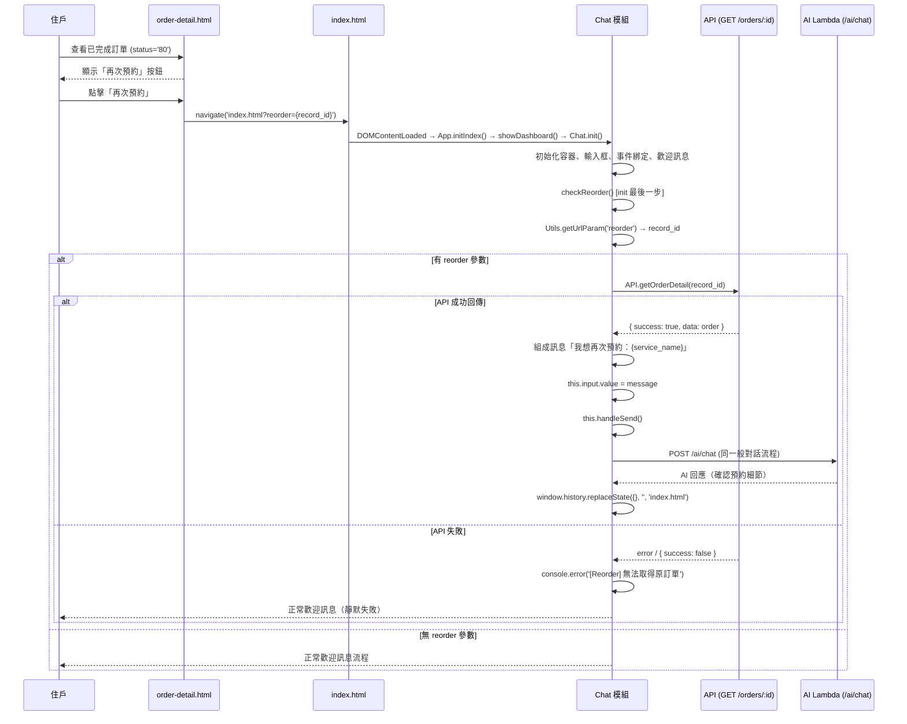

# 設計文件：再次預約（Order Reorder）

## Overview

本功能讓已完成訂單（status='80'）的住戶，透過訂單詳情頁的「再次預約」按鈕，一鍵跳轉至首頁 AI 對話介面，系統自動帶入原訂單服務名稱組成訊息送入對話，讓 AI 直接進入預約確認流程，省去使用者重複輸入服務需求的步驟。

**設計原則：**
- 最小修改範圍：僅改動前端 `orders.js` 與 `chat.js`，不動後端 Lambda
- 沿用既有 API：使用已存在的 `GET /orders/:id` 取得原訂單資料
- 靜默失敗：任何環節出錯均不影響正常聊天流程

## Architecture

### 整體流程

功能透過 URL 參數 `reorder={record_id}` 作為前後頁面的溝通橋樑：

1. 訂單詳情頁修改按鈕的跳轉目標，從 `form.html?form_id=X` 改為 `index.html?reorder={record_id}`
2. 首頁 Chat 模組初始化完成後偵測 URL 參數，自動查詢原訂單並組成訊息送入對話
3. 送出後清除 URL 參數，避免重新整理時重複觸發

### 時序圖



## Components and Interfaces

### 1. Orders.renderDetail() — 按鈕修改

**檔案**：`js/orders.js`

**修改點**：`renderDetail()` 方法中 `order_status === '80'` 的按鈕 `onclick`

```javascript
// 修改前
actionsHtml += `<button class="btn btn-primary btn-block" onclick="Utils.navigate('form.html?form_id=${order.service_id}')">再次預約</button>`;

// 修改後
actionsHtml += `<button class="btn btn-primary btn-block" onclick="Utils.navigate('index.html?reorder=${order.record_id}')">再次預約</button>`;
```

**設計決策**：使用 `record_id` 而非 `service_id` 作為參數，因為需要查詢完整訂單資料（包含 service_name、remark 等）來組成上下文訊息。

### 2. Chat.checkReorder() — 新增方法

**檔案**：`js/chat.js`

**位置**：加在 `Chat` 物件中，於 `init()` 最末尾呼叫

**介面定義**：

```javascript
/**
 * 偵測 URL reorder 參數，自動送出再次預約訊息
 * 前置條件：Chat.init() 已完成所有初始化（DOM、事件綁定、歡迎訊息）
 * 後置條件：若成功則送出一則用戶訊息並清除 URL 參數；若失敗則靜默回退
 */
async checkReorder() {
  const reorderId = Utils.getUrlParam('reorder');
  if (!reorderId) return;

  try {
    const result = await API.getOrderDetail(reorderId);
    if (!result || !result.success || !result.data) {
      console.error('[Reorder] 無法取得原訂單:', reorderId);
      return;
    }

    const order = result.data;
    const serviceName = order.service_name || order.remark || '上次的服務';
    const message = `我想再次預約：${serviceName}`;

    this.input.value = message;
    this.handleSend();

    window.history.replaceState({}, '', 'index.html');
  } catch (e) {
    console.error('[Reorder] Error:', e);
  }
}
```

### 3. Chat.init() — 呼叫時機

在 `init()` 末尾（`initVoice()` 之後）加入：

```javascript
// 檢查再次預約參數
this.checkReorder();
```

**時序保證**：
- `Chat.init()` 在 `App.showDashboard()` 內被呼叫
- `showDashboard()` 僅在使用者驗證通過且 Dashboard DOM 可見後才執行
- `checkReorder()` 是 `init()` 的最後一步，此時所有前置條件已滿足：
  - `this.container` 存在
  - `this.input` 存在
  - `this.handleSend()` 可用
  - 歡迎訊息已 render

### 4. 既有介面（不修改）

| 介面 | 用途 | 回傳格式 |
|------|------|----------|
| `API.getOrderDetail(id)` | 取得單筆訂單詳情 | `{ success: boolean, data: Order }` |
| `Chat.handleSend()` | 送出 input 中的訊息 | void |
| `Utils.getUrlParam(name)` | 取得 URL 查詢參數 | `string \| null` |

## Data Models

### Order 物件（既有，相關欄位）

```typescript
interface Order {
  record_id: string;       // 訂單唯一識別碼
  order_no: string;        // 訂單編號（顯示用）
  order_status: string;    // 訂單狀態碼 ('80' = 已完成)
  service_id: string;      // 服務 ID
  service_name: string;    // 服務名稱（如「居家清潔」）
  remark: string;          // 備註
  vendor_name: string;     // 服務商名稱
  // ... 其他欄位
}
```

### URL 參數格式

```
index.html?reorder={record_id}
```

- `record_id`：原訂單的 `record_id` 值，字串格式
- 範例：`index.html?reorder=ORD20240301001`

### Service Context Message 組成規則

```
優先序：service_name > remark > '上次的服務'
格式：「我想再次預約：{取得的值}」
```

## Correctness Properties

*正確性屬性是一種在系統所有有效執行中都應成立的特徵或行為——本質上是對系統應做什麼的形式化陳述。屬性作為人類可讀規格與機器可驗證正確性保證之間的橋樑。*

### Property 1: 再次預約按鈕顯示條件

*For any* 訂單物件 order，renderDetail(order) 產生的 HTML 中包含「再次預約」按鈕 ⟺ order.order_status === '80'

**Validates: Requirements 1.1, 1.2, 1.3**

### Property 2: 再次預約跳轉 URL 正確性

*For any* 已完成訂單 order（order_status === '80'），renderDetail(order) 產生的再次預約按鈕 onclick 目標 SHALL 為 `index.html?reorder={order.record_id}`，且不包含 `form.html`

**Validates: Requirements 2.1, 2.2**

### Property 3: Service Context Message 格式正確性

*For any* 訂單物件 order 且 API 回傳成功，checkReorder() 組成的訊息 SHALL 等於 `我想再次預約：${order.service_name || order.remark || '上次的服務'}`

**Validates: Requirements 3.2, 3.3**

### Property 4: 錯誤時靜默回退

*For any* API 錯誤回應（null、{success: false}、network error），checkReorder() SHALL 不送出任何訊息且不拋出未捕獲例外，聊天介面維持正常歡迎訊息狀態

**Validates: Requirements 4.1, 4.2**

## Error Handling

| 錯誤場景 | 處理方式 | 使用者體驗 |
|----------|----------|-----------|
| `reorder` 參數為空或不存在 | `checkReorder()` 立即 return | 正常歡迎訊息，無感知 |
| `API.getOrderDetail()` 回傳 `{success: false}` | `console.error` + return | 正常歡迎訊息，無感知 |
| `API.getOrderDetail()` 回傳 null / undefined | `console.error` + return | 正常歡迎訊息，無感知 |
| 網路錯誤（fetch 失敗） | try/catch 捕獲 + `console.error` | 正常歡迎訊息，無感知 |
| 訂單資料中 service_name 與 remark 皆為空 | fallback 為 `'上次的服務'` | 送出「我想再次預約：上次的服務」 |

**設計決策**：所有錯誤情境均採「靜默失敗」策略。原因：
1. 使用者點擊再次預約的意圖是進入 AI 對話，即使原訂單資料取得失敗，對話介面本身仍可正常使用
2. 錯誤訊息僅記錄至 console，供開發者除錯
3. 不使用 `Utils.toast()` 顯示錯誤，避免打斷使用者體驗

## Testing Strategy

### 單元測試（Example-Based）

| 測試項目 | 驗證重點 |
|----------|----------|
| 按鈕文字 | renderDetail() 產生的按鈕文字為「再次預約」 |
| 無 reorder 參數 | checkReorder() 不呼叫 API、不送訊息 |
| URL 清除 | 成功送出後 `window.location.search` 不含 reorder |

### 屬性測試（Property-Based）

**測試框架**：fast-check（JavaScript property-based testing library）

**配置**：每個屬性測試至少執行 100 次迭代

| Property | 測試策略 | 產生器 |
|----------|----------|--------|
| Property 1 | 產生隨機 order_status（含 '80' 與非 '80'），mock DOM，驗證按鈕存在性 | `fc.oneof(fc.constant('80'), fc.stringOf(fc.constantFrom('0','1','2','3','4','5','6','7','8','9'), {minLength:2, maxLength:2}))` |
| Property 2 | 產生隨機 record_id，mock DOM，驗證 onclick URL | `fc.string({minLength:1, maxLength:30})` |
| Property 3 | 產生隨機 service_name / remark 組合，mock API 回傳，驗證訊息格式 | `fc.record({ service_name: fc.option(fc.string()), remark: fc.option(fc.string()) })` |
| Property 4 | 產生各種錯誤回應，mock API，驗證無訊息送出且無例外拋出 | `fc.oneof(fc.constant(null), fc.constant({success:false}), fc.constant(undefined))` |

**標籤格式**：
- Feature: order-reorder, Property 1: 再次預約按鈕顯示條件
- Feature: order-reorder, Property 2: 再次預約跳轉 URL 正確性
- Feature: order-reorder, Property 3: Service Context Message 格式正確性
- Feature: order-reorder, Property 4: 錯誤時靜默回退

### 整合測試

| 測試項目 | 驗證重點 |
|----------|----------|
| 完整流程 | 模擬從訂單詳情頁跳轉 → 首頁偵測參數 → 自動送出訊息 → AI 回應 |
| API 真實呼叫 | 使用測試訂單 ID 呼叫 `GET /orders/:id` 確認回傳格式 |
