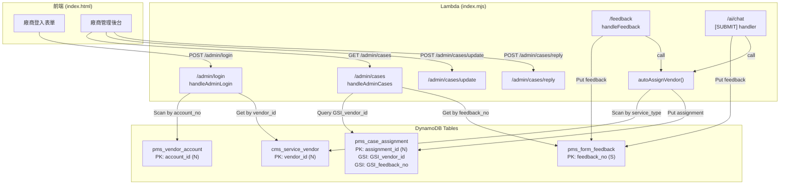
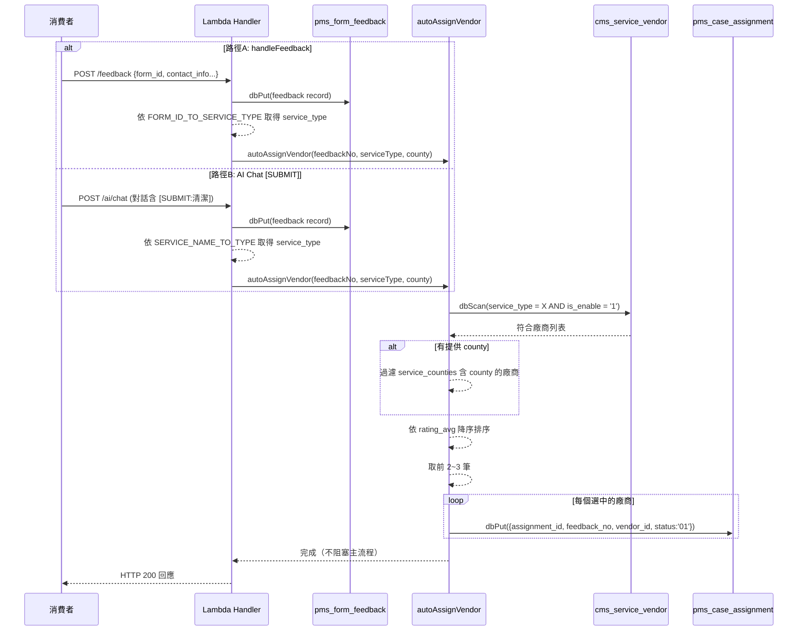

# Design Document — 廠商後台 (vendor-admin)

## Overview

本設計實作廠商後台功能的三大核心模組：

1. **登入修正** — 將 `handleAdminLogin` 從查詢不存在的 `vendor_accounts` 表改為 Scan `pms_vendor_account` 表
2. **自動媒合** — 新增 `autoAssignVendor` 函式，在消費者建立諮詢單時自動依服務類型與地區匹配廠商
3. **案件查詢改寫** — `handleAdminCases` 改用 `pms_case_assignment` 的 GSI 篩選該廠商的案件
4. **前端串接** — 將 mock 資料替換為真實 API 呼叫

所有改動限制在 `lambda/chat/index.mjs` (後端) 與 `index.html` (前端) 兩個檔案內。

---

## Architecture

### 系統架構圖



### 自動媒合時序圖



---

## Components and Interfaces

### 1. handleAdminLogin(body) — 重寫

**輸入：**
```js
{ username: string, password: string }
```

**處理邏輯：**
1. 驗證 username/password 非空
2. `dbScan('pms_vendor_account', 'account_no = :u', { ':u': username })` — 取得帳號記錄
3. 若無結果 → 401 "帳號或密碼錯誤"
4. 若 `password_hash !== password` → 401 "帳號或密碼錯誤"
5. 若 `is_enable !== '1'` → 401 "此帳號已停用"
6. `dbGet('cms_service_vendor', { vendor_id: account.vendor_id })` — 取得店名
7. 回傳 `{ vendorId, name, shopName }`

**輸出：**
```js
// 成功
{ success: true, data: { vendorId: 1, name: '管理員名稱', shopName: '潔淨居家清潔' }, message: '登入成功' }
// 失敗
{ success: false, data: null, message: '帳號或密碼錯誤' }
```

### 2. autoAssignVendor(feedbackNo, serviceType, county) — 新增

**輸入：**
| 參數 | 型態 | 說明 |
|---|---|---|
| feedbackNo | string | 諮詢單編號 (如 'FB1234567890') |
| serviceType | number | 服務類型代碼 (已轉換完成) |
| county | string \| null | 消費者所在縣市 (可選) |

**處理邏輯：**
1. Scan `cms_service_vendor` where `service_type = serviceType AND is_enable = '1'`
2. 若 county 非空，filter `service_counties` 含 county
3. 依 `rating_avg` 降序排序
4. 取前 min(matchCount, 3) 筆
5. 對每筆建立 `pms_case_assignment` 記錄
6. 任何錯誤只 log，不 throw

**輸出：** `void` (async, 不回傳值)

### 3. 服務映射常數

```js
// 服務名稱 → service_type (用於 AI Chat [SUBMIT])
const SERVICE_NAME_TO_TYPE = {
  '外送': 6, '餐廳外送': 6, '訂位': 6, '餐廳訂位': 6,
  '清潔': 1, '居家清潔': 1,
  '家電清洗': 2,
  '修繕': 10, '水電修繕': 10,
  '宅配': 3, '包裹寄送': 3, '寄件': 3,
  '購物': 11, '商品購買': 11,
  '叫車': 13, '計程車': 13,
  '領藥': 12, '代領藥品': 12,
};

// form_id → service_type (用於 handleFeedback)
const FORM_ID_TO_SERVICE_TYPE = {
  1: 6,   // 餐廳
  2: 11,  // 購物
  3: 1,   // 清潔 (預設)
  4: 3,   // 寄件
};
```

### 4. handleAdminCases(qs) — 重寫

**輸入：**
```js
{ vendor_id?: string, status?: string }
```

**處理邏輯：**
1. 若有 `vendor_id`：
   - `dbQuery('pms_case_assignment', 'GSI_vendor_id', 'vendor_id = :v', { ':v': Number(vendor_id) })`
   - 對每筆 assignment，`dbGet('pms_form_feedback', { feedback_no })`
   - 合併為完整案件物件
   - 若有 `status` 參數，進一步篩選
2. 若無 `vendor_id`（向下相容）：
   - 照舊 Scan `pms_form_feedback` 全表

**輸出：**
```js
// 成功回傳 { success: true, data: [...], message: '' }
// data 陣列中每筆結構：
{
  id: 'FB1234567890',
  assignmentId: 1234567890,
  vendorId: 1,
  assignmentStatus: '01',
  customerName: '王小明',
  customerPhone: '0912345678',
  customerEmail: 'test@example.com',
  service: '居家清潔',
  status: '01',
  createdAt: '2025-01-01T00:00:00.000Z',
  address: '台北市大安區忠孝東路100號',
  description: '...',
  replies: []
}
```

### 5. 前端介面改動

| 函式 | 改動 |
|---|---|
| `vendorLogin()` | 呼叫 `POST /admin/login`，成功後存 localStorage 並呼叫 `vendorShowDashboard()` |
| `vendorShowDashboard()` | 呼叫 `GET /admin/cases?vendor_id={vendorId}` 取得案件，取代 mock |
| `vendorUpdateStatus(id, status)` | 呼叫 `POST /admin/cases/update`，成功後 refresh |
| `vendorReply(id, content)` | 呼叫 `POST /admin/cases/reply`，成功後 refresh |
| 錯誤處理 | 所有 API 失敗顯示 toast，不破壞 UI 狀態 |

---

## Data Models

### pms_vendor_account（既有表）

| 欄位 | 型態 | 說明 |
|---|---|---|
| account_id | N (PK) | 帳號 ID |
| account_no | S | 登入帳號 (如 clean01) |
| password_hash | S | 密碼 (目前為明文) |
| vendor_id | N | 對應廠商 ID |
| name | S | 帳號名稱 |
| is_enable | S | '1' 啟用 / '0' 停用 |

### cms_service_vendor（既有表）

| 欄位 | 型態 | 說明 |
|---|---|---|
| vendor_id | N (PK) | 廠商 ID |
| name | S | 廠商名稱 (如 '潔淨居家清潔') |
| service_type | N | 服務類型代碼 |
| rating_avg | N | 平均評分 |
| service_counties | L[S] | 服務區域列表 (如 ['台北市','新北市']) |
| is_enable | S | '1' 啟用 / '0' 停用 |

### pms_case_assignment（既有表）

| 欄位 | 型態 | 說明 |
|---|---|---|
| assignment_id | N (PK) | 分派 ID (Date.now() + offset) |
| feedback_no | S | 對應諮詢單編號 |
| vendor_id | N | 被指派的廠商 ID |
| status | S | '01' 待回應 / '02' 已承接 / '03' 處理中 / '04' 已完成 |
| cre_time | S | 建立時間 (ISO) |

**GSI：**
- `GSI_vendor_id`: PK = vendor_id (N) — 查詢某廠商的所有案件
- `GSI_feedback_no`: PK = feedback_no (S) — 查詢某諮詢單的所有指派

### pms_form_feedback（既有表）

| 欄位 | 型態 | 說明 |
|---|---|---|
| feedback_no | S (PK) | 諮詢單編號 |
| form_id | N | 表單類型 |
| contact_name | S | 消費者姓名 |
| contact_mobile | S | 消費者手機 |
| contact_email | S | 消費者 Email |
| contact_address_county | S | 縣市 |
| contact_address_district | S | 行政區 |
| contact_address_detail | S | 詳細地址 |
| description | S | 需求描述 |
| feedback_content | S | JSON 格式完整內容 |
| status | S | '01' 待處理 / '02' 處理中 / '03' 已結案 |
| cre_time | S | 建立時間 |

---

## Correctness Properties

*A property is a characteristic or behavior that should hold true across all valid executions of a system — essentially, a formal statement about what the system should do. Properties serve as the bridge between human-readable specifications and machine-verifiable correctness guarantees.*

### Property 1: 登入成功回傳完整資訊

*For any* 有效的帳號/密碼組合 (帳號存在、密碼正確、帳號啟用)，登入回傳的物件必定包含 `vendorId`、`name`、`shopName` 三個欄位，且 `vendorId` 為數字、`shopName` 來自 `cms_service_vendor` 表。

**Validates: Requirements 1.5**

### Property 2: 服務名稱映射完整性

*For any* SERVICE_NAME_TO_TYPE 映射表中的 key，轉換結果必定為正整數，且同一語意群組 (如 '外送'/'餐廳外送') 映射到相同的 service_type。

**Validates: Requirements 2.2**

### Property 3: 廠商篩選只回傳啟用且匹配的廠商

*For any* 廠商集合與指定的 service_type，`autoAssignVendor` 的篩選結果中每一筆廠商必定滿足 `service_type === 指定值` 且 `is_enable === '1'`。

**Validates: Requirements 2.3**

### Property 4: 地區篩選正確性

*For any* 廠商集合與指定的 county 值，經地區篩選後的結果中每一筆廠商的 `service_counties` 列表必定包含該 county。

**Validates: Requirements 2.4**

### Property 5: 排序不變量 — rating_avg 降序

*For any* 經篩選後的廠商列表，排序結果中第 i 筆的 `rating_avg` 必定大於等於第 i+1 筆的 `rating_avg`。

**Validates: Requirements 2.5**

### Property 6: 指派數量上限

*For any* N 筆符合條件的廠商 (N >= 1)，建立的 assignment 記錄數必定等於 `min(N, 3)`。

**Validates: Requirements 2.6**

### Property 7: 案件合併結果包含完整欄位

*For any* assignment 與其對應的 feedback 記錄，合併後的物件必定包含 assignment_id、status、vendor_id (來自 assignment) 以及 customerName、customerPhone、service、description、address、createdAt (來自 feedback)。

**Validates: Requirements 3.2, 3.3**

### Property 8: 狀態篩選正確性

*For any* 案件集合與指定的 status 篩選值，回傳結果中每一筆案件的 assignment status 必定等於該篩選值。

**Validates: Requirements 3.5**

---

## Error Handling

### 登入錯誤

| 情境 | HTTP Status | 回應訊息 |
|---|---|---|
| 帳號/密碼為空 | 400 | "請輸入帳號與密碼" |
| 帳號不存在 | 401 | "帳號或密碼錯誤" |
| 密碼錯誤 | 401 | "帳號或密碼錯誤" |
| 帳號已停用 | 401 | "此帳號已停用" |
| DynamoDB Scan 失敗 | 500 | "系統錯誤，請稍後再試" |

### autoAssignVendor 錯誤處理

| 情境 | 處理方式 |
|---|---|
| 無匹配廠商 | `console.warn()` 並正常回傳，不建立 assignment |
| service_type 未定義 (映射不到) | 使用 fallback 或 log warning，不阻塞主流程 |
| dbPut assignment 失敗 | `console.error()` 並繼續下一筆，不 throw |
| dbScan vendor 失敗 | `console.error()` 並正常回傳，不阻塞 |

### 前端錯誤處理

| 情境 | 處理方式 |
|---|---|
| API 回傳非 200 | 顯示 toast 提示錯誤訊息，維持當前 UI |
| 網路離線 | 顯示 toast "網路連線異常"，不清除已載入資料 |
| JSON 解析失敗 | 顯示 toast "資料格式錯誤"，維持當前 UI |

### 設計決策

**1. handleCreateOrder 不觸發 autoAssignVendor（故意設計）：**

`handleCreateOrder` (POST /orders) 的 required fields 包含 `service_vendor_id`（明確指定廠商），代表這筆訂單建立時已知由誰處理，無需再做媒合。autoAssignVendor 僅針對「消費者提出需求但尚未確定廠商」的諮詢單流程：

| 路徑 | 情境 | 觸發 autoAssignVendor？ |
|------|------|------------------------|
| handleFeedback | 消費者填表單提需求 | ✅ |
| AI [SUBMIT] | AI 對話收集完需求 | ✅ |
| handleCreateOrder | 已確定廠商的正式訂單 | ❌ 不觸發 |

**2. autoAssignVendor 必須 await（非 fire-and-forget）：**

Lambda 環境在 response 送出後會凍結，背景 Promise 不保證執行完成。因此呼叫端必須 `await autoAssignVendor(...)`。但函式內部自行 try/catch 隔離錯誤，確保即使媒合失敗，主流程（feedback 建立）已成功、不會被 rollback：

```js
await dbPut('pms_form_feedback', item);
await autoAssignVendor(feedbackNo, serviceType, county);  // await 等完成
return ok({ feedback_no: feedbackNo }, '表單提交成功');    // 不受媒合失敗影響
```

**3. handleAdminCases 逐筆 GetItem 效能評估：**

Demo 規模下一個廠商的案件數預估 5-20 筆。DynamoDB GetItem 延遲約 1-5ms/次，20 筆 × 5ms = 100ms，在 Lambda 30s timeout 下完全可接受。未來資料量成長可改用 `BatchGetItem`（一次最多 100 key）優化，但目前不需要。

---

## Testing Strategy

### 單元測試 (Example-based)

| 測試項目 | 驗證內容 |
|---|---|
| 登入 — 帳號不存在 | 驗證回傳 401 + 正確訊息 |
| 登入 — 密碼錯誤 | 驗證回傳 401 + 正確訊息 |
| 登入 — 帳號停用 | 驗證回傳 401 + "此帳號已停用" |
| 登入 — 成功 | 驗證回傳 200 + 完整欄位 |
| autoAssignVendor — 無匹配 | 驗證不建立 assignment、不 throw |
| autoAssignVendor — 錯誤隔離 | Mock dbPut 拋錯，驗證不影響呼叫者 |
| handleAdminCases — 無 vendor_id | 驗證向下相容回傳全部 |
| 前端 — API 失敗 | 驗證 toast 顯示且 UI 不破壞 |

### 屬性測試 (Property-based)

使用 `fast-check` 作為屬性測試框架。

| Property | 測試策略 | 迭代次數 |
|---|---|---|
| Property 1: 登入回傳完整資訊 | 生成隨機有效帳號/廠商組合，驗證回傳欄位 | 100 |
| Property 2: 服務映射完整性 | 從 mapping keys 隨機取值，驗證結果為正整數 | 100 |
| Property 3: 篩選只回傳匹配廠商 | 生成隨機廠商列表 + service_type，驗證篩選結果 | 100 |
| Property 4: 地區篩選正確性 | 生成隨機廠商列表 + county，驗證篩選結果 | 100 |
| Property 5: 排序降序不變量 | 生成隨機 rating_avg 列表，驗證排序結果 | 100 |
| Property 6: 指派數量上限 | 生成 1~10 筆廠商，驗證 assignment 數 = min(N,3) | 100 |
| Property 7: 合併結果完整性 | 生成隨機 assignment + feedback，驗證合併欄位 | 100 |
| Property 8: 狀態篩選正確性 | 生成隨機案件 + status，驗證篩選結果 | 100 |

**標記格式：** 每個屬性測試需加上註解
```js
// Feature: vendor-admin, Property 3: 篩選只回傳啟用且匹配的廠商
```

### 整合測試

| 測試項目 | 驗證內容 |
|---|---|
| 登入 → DynamoDB Scan 正確表 | 驗證對 pms_vendor_account 執行 Scan |
| handleFeedback → autoAssignVendor 觸發 | 建立 feedback 後驗證 assignment 被建立 |
| AI Chat [SUBMIT] → autoAssignVendor 觸發 | AI 對話建單後驗證 assignment 被建立 |
| handleAdminCases → GSI 查詢正確 | 驗證使用 GSI_vendor_id 查詢 |

### 部署驗證階段

依 Requirement 5.5 分階段部署：

1. **Phase 1 (login fix):** 部署後用測試帳號登入驗證
2. **Phase 2 (auto-assign):** 建立諮詢單後檢查 pms_case_assignment 是否有新記錄
3. **Phase 3 (admin cases + frontend):** 登入後台確認看到真實案件資料
