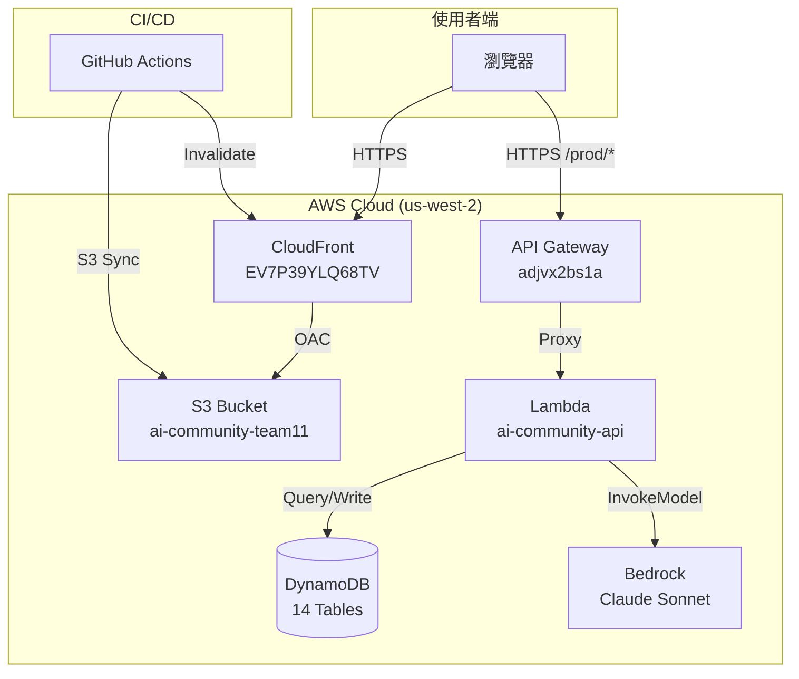

# 系統架構文件 - Aî 智慧社區服務平台

## 1. 系統架構總覽



## 2. 服務元件說明

### CloudFront（CDN）

- **Distribution ID**: `EV7P39YLQ68TV`
- **Domain**: `dgkio156x1pmj.cloudfront.net`
- **用途**: 快取並分發靜態前端資源，提供 HTTPS 終端
- **Origin**: S3 Bucket，透過 OAC（Origin Access Control）存取

### S3（靜態資源託管）

- **Bucket**: `ai-community-team11`
- **Region**: `us-west-2`
- **內容**: HTML、CSS、JS、圖片等前端資源
- **存取控制**: 停用公開存取，僅允許 CloudFront 透過 OAC 讀取

### API Gateway（REST API）

- **API ID**: `adjvx2bs1a`
- **Endpoint**: `https://adjvx2bs1a.execute-api.us-west-2.amazonaws.com/prod`
- **整合方式**: AWS_PROXY（Lambda Proxy Integration）
- **路由**: `{proxy+}` + ANY method，所有路徑轉發至 Lambda

### Lambda（後端邏輯）

- **Function Name**: `ai-community-api`
- **Runtime**: `nodejs20.x`
- **Handler**: `index.handler`
- **Timeout**: 30 秒
- **Memory**: 256 MB
- **程式碼**: `lambda/chat/index.mjs`（ESM 模組）

### DynamoDB（NoSQL 資料庫）

- **計費模式**: PAY_PER_REQUEST（依需求付費）
- **資料表數量**: 14 張（10 張核心表 + 4 張表單結構表）
- **特性**: 使用 GSI 支援多維度查詢

### Bedrock（AI 服務）

- **Model**: `us.anthropic.claude-sonnet-4-6`
- **用途**: AI 對話助手，處理社區服務諮詢
- **Max Tokens**: 1024
- **Temperature**: 0.7

## 3. 資料流程

### 靜態頁面載入

```
使用者 → CloudFront (dgkio156x1pmj.cloudfront.net)
       → S3 (ai-community-team11) → 回傳 HTML/CSS/JS
```

### AI 對話互動

```
使用者輸入訊息
  → 前端 POST /ai/chat（帶 text + history）
  → API Gateway (adjvx2bs1a)
  → Lambda (ai-community-api)
  → Bedrock InvokeModel（Claude 生成回覆）
  → Lambda 解析回覆、檢查 [SUBMIT] 標記
  → 回傳 JSON { success, data: { reply } }
```

### 資料查詢流程

```
前端 GET /vendors 或 /districts
  → API Gateway
  → Lambda
  → DynamoDB Query/Scan
  → 回傳 JSON 結果
```

### CI/CD 部署流程

```
開發者 push 至 main 分支（ai-community-web/ 目錄變更）
  → GitHub Actions 觸發
  → aws s3 sync 同步至 S3（排除 .pdf, .sql）
  → aws cloudfront create-invalidation 清除快取
```

## 4. DynamoDB 資料表 Schema

### 核心資料表（10 張）

#### inbr_member（會員資料）

| 欄位 | 類型 | Key |
|------|------|-----|
| inbr_account_id | S | PK |
| name, phone, email 等 | S | — |

#### pms_vendor_account（廠商帳號）

| 欄位 | 類型 | Key |
|------|------|-----|
| account_id | N | PK |
| vendor_id | N | GSI: GSI_vendor_id |

#### cms_service_vendor（服務廠商）

| 欄位 | 類型 | Key |
|------|------|-----|
| vendor_id | N | PK |
| vendor_name, service_type 等 | S | — |

#### pms_form_feedback（諮詢單）

| 欄位 | 類型 | Key |
|------|------|-----|
| feedback_no | S | PK |
| inbr_account_id | S | GSI: GSI_inbr_account_id (PK) |
| cre_time | S | GSI: GSI_inbr_account_id (SK) |

#### pms_case_assignment（派案）

| 欄位 | 類型 | Key |
|------|------|-----|
| assignment_id | N | PK |
| feedback_no | S | GSI: GSI_feedback_no |
| vendor_id | N | GSI: GSI_vendor_id |

#### pms_case_reply（回覆）

| 欄位 | 類型 | Key |
|------|------|-----|
| reply_id | N | PK |
| assignment_id | N | GSI: GSI_assignment_id (PK) |
| reply_time | S | GSI: GSI_assignment_id (SK) |

#### pms_case_status_log（狀態歷程）

| 欄位 | 類型 | Key |
|------|------|-----|
| log_id | N | PK |
| feedback_no | S | GSI: GSI_feedback_no (PK) |
| change_time | S | GSI: GSI_feedback_no (SK) |

#### pms_case_review（評價）

| 欄位 | 類型 | Key |
|------|------|-----|
| review_id | N | PK |
| vendor_id | N | GSI: GSI_vendor_id |

#### mms_order_record（訂單記錄）

| 欄位 | 類型 | Key |
|------|------|-----|
| record_id | N | PK |
| inbr_account_id | S | GSI: GSI_inbr_account_id (PK) |
| order_time | S | GSI: GSI_inbr_account_id (SK) |

#### sys_district（縣市區域）

| 欄位 | 類型 | Key |
|------|------|-----|
| county_code | S | PK |
| code | S | SK |

### 表單結構資料表（4 張）

| 資料表 | 用途 |
|--------|------|
| pms_form | 表單主檔 |
| pms_form_group | 表單群組 |
| pms_form_topic | 表單題目 |
| pms_topic_option | 題目選項 |

## 5. 安全設計

### S3 存取控制

- Bucket 已**停用所有公開存取**（Block Public Access 全開）
- 僅透過 CloudFront OAC 存取，確保所有流量經過 CDN
- Bucket Policy 限定 `cloudfront.amazonaws.com` Service Principal

### CloudFront 安全

- 強制 HTTPS（Viewer Protocol Policy: redirect-to-https）
- 使用 Origin Access Control（OAC）取代舊版 OAI
- 支援自動 SSL 憑證

### API 安全

- Lambda 回應包含 CORS Headers，限制跨域存取
- API Gateway 採用 AWS_PROXY 整合，所有請求經 Lambda 驗證
- 輸入驗證：檢查必填欄位、限制歷史訊息長度（最多 30 條）

### IAM 最小權限

- Lambda 執行角色僅授予：
  - `AWSLambdaBasicExecutionRole`（CloudWatch Logs）
  - DynamoDB 存取權限（限定相關資料表）
  - Bedrock InvokeModel 權限（限定特定 Model）

### 資料保護

- DynamoDB 使用 AWS 管理的加密金鑰（預設啟用靜態加密）
- 所有傳輸層使用 TLS 加密
- 敏感設定（API Key 等）透過環境變數或 GitHub Secrets 管理
